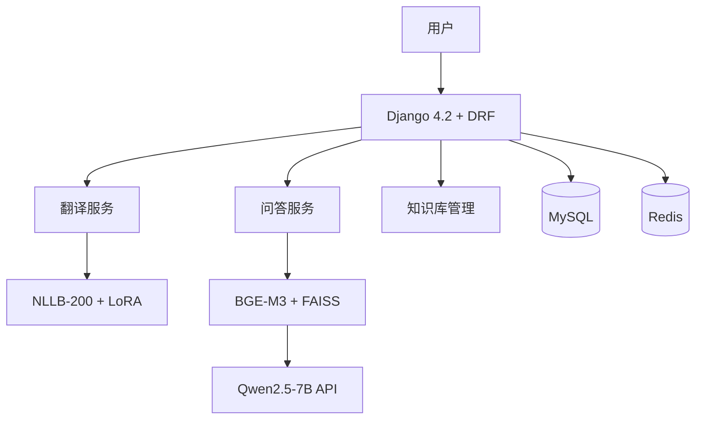

<div align="center">

# Medical AI System

**医疗多语言翻译与知识问答平台**

[](https://python.org)
[](https://djangoproject.com)
[](https://www.django-rest-framework.org/)
[](LICENSE)
[](https://github.com/yourusername/medical-ai-system/actions/workflows/ci.yml)
[](https://docker.com)

</div>

---

## 项目简介

面向医疗场景的多语言互译与知识问答系统，覆盖从 **LoRA 模型微调 → RAG 检索增强生成 → Web 服务部署** 的完整 AI 应用链路。

### 核心能力

| 能力 | 说明 |
|---|---|
| **多语言翻译** | NLLB-200 + LoRA 微调，支持 5 种语言（中/英/法/德/日）医疗领域互译 |
| **智能问答** | RAG 流水线：BGE-M3 向量检索 + FAISS 近似搜索 + Qwen2.5-7B LLM 生成 |
| **知识库管理** | 上传 → 实体抽取 → 审核 → 多语言索引构建全流程 |
| **术语引擎** | 翻译结果中的医疗术语自动识别、高亮与知识卡片展示 |
| **质量评测** | RAG 检索评测 (Recall@K/MRR/NDCG) + LLM-as-Judge 自动打分 + 用户反馈闭环 |
| **审计追踪** | 全接口审计日志、操作留痕 |

---

## 技术栈

<details>
<summary><b>点击展开</b></summary>

### 后端框架
| 技术 | 用途 |
|---|---|
| Django 4.2 | Web 框架 / ORM / Admin |
| Django REST Framework | REST API |
| SimpleJWT | JWT 认证 |
| MySQL 8.0 | 业务数据库 |
| Redis 7 | 缓存 / Session |

### AI / 大模型
| 模型 | 用途 | 参数规模 |
|---|---|---|
| NLLB-200-distilled-600M | 翻译基座模型 | 600M |
| NLLB + LoRA (medical) | 医疗领域微调适配器 | ~8M (r=16) |
| BGE-M3 | 多语言文本嵌入 | ~568M |
| Qwen2.5-7B-Instruct | 问答生成 (通过 SiliconFlow API) | 7B |

### AI 框架
| 技术 | 用途 |
|---|---|
| Transformers / PEFT | 模型加载与 LoRA 微调 |
| FAISS | 向量近似检索 (IndexFlatIP) |
| sentence-transformers | Embedding 生成 |
| LangChain (text-splitters) | 文本分块 |

### 工程化
| 技术 | 用途 |
|---|---|
| Docker / docker-compose | 容器化部署 |
| Gunicorn | WSGI 生产服务器 |
| GitHub Actions | CI/CD |
| drf-spectacular | Swagger / OpenAPI 文档 |
| pytest | 单元测试 |
| pre-commit | 代码规范 |

</details>

---

## 快速开始

### 方式一：Docker 部署（推荐）

```bash
# 1. 克隆项目
git clone https://github.com/yourusername/medical-ai-system.git
cd medical-ai-system

# 2. 配置环境变量
cp .env.example .env
# 编辑 .env 填入 SiliconFlow API Key

# 3. 启动所有服务
docker-compose up -d

# 4. 访问
# API: http://localhost:8000/api/
# Swagger 文档: http://localhost:8000/api/docs/
# Admin: http://localhost:8000/admin/
```

### 方式二：本地开发

```bash
# 1. 创建虚拟环境
python -m venv venv
source venv/bin/activate  # Windows: venv\Scripts\activate

# 2. 安装依赖
pip install -r requirements.txt

# 3. 配置环境变量
cp .env.example .env
# 编辑 .env 配置数据库连接和 API Key

# 4. 初始化数据库
python manage.py migrate

# 5. 启动开发服务
python manage.py runserver
```

---

## 项目结构

```
medical_ai_system/
├── backend/                    # Django 后端
│   ├── apps/                   # 业务应用
│   │   ├── accounts/           #   用户认证
│   │   ├── translation/        #   翻译服务 + 术语匹配
│   │   ├── qa/                 #   问答服务
│   │   ├── kb/                 #   知识库管理
│   │   ├── history/            #   历史记录
│   │   ├── feedback/           #   用户反馈
│   │   ├── audit/              #   审计日志
│   │   └── evaluation/         #   RAG 评测 + LLM-as-Judge
│   ├── core/                   # AI 引擎层
│   │   ├── llm/                #   大模型调用 (NLLB + Qwen)
│   │   ├── rag/                #   RAG 检索 (FAISS)
│   │   ├── embeddings/         #   BGE-M3 向量化
│   │   └── views.py            #   健康检查
│   └── data/                   # 数据文件
├── config/                     # Django 配置
├── scripts/                    # 训练与数据处理
│   ├── train_nllb_lora.py      #   LoRA 微调脚本
│   ├── build_kb_multilang.py   #   多语言知识库构建
│   └── models/                 #   训练产物
├── templates/                  # 前端页面
├── static/                     # 静态资源
├── tests/                      # 单元测试
├── Dockerfile                  # 容器构建
├── docker-compose.yml          # 容器编排
├── .env.example                # 环境变量模板
├── .pre-commit-config.yaml     # 代码规范
└── Makefile                    # 快捷命令
```

---

## API 概览

| 端点 | 方法 | 认证 | 说明 |
|---|---|---|---|
| `/api/health/` | GET | 否 | 健康检查 |
| `/api/auth/login/` | POST | 否 | JWT 登录 |
| `/api/auth/refresh/` | POST | 否 | 刷新 Token |
| `/api/translate/` | POST | JWT | 多语言翻译 (NLLB + LoRA) |
| `/api/qa/` | POST | JWT | RAG 医疗问答 |
| `/api/kb/entities/` | GET/POST | JWT | 知识实体管理 |
| `/api/kb/upload/` | POST | JWT | 知识库文档上传 |
| `/api/history/` | GET | JWT | 查询历史记录 |
| `/api/feedback/` | POST | JWT | 提交反馈 |
| `/api/eval/dashboard/` | GET | JWT | 质量总览仪表盘 |
| `/api/eval/runs/` | GET | JWT | 评测运行历史 |
| `/api/eval/trigger/rag/` | POST | Admin | 触发 RAG 检索评测 |
| `/api/eval/trigger/answer_quality/` | POST | Admin | 触发回答质量评测 |
| `/api/eval/judge/` | POST | Admin | 单条 LLM-as-Judge 打分 |
| `/api/docs/` | GET | 否 | Swagger API 文档 |
| `/api/redoc/` | GET | 否 | ReDoc API 文档 |

---

## 训练与微调

项目提供完整的 LoRA 微调管线：

```bash
# 1. 下载 ParaMed 医疗平行语料
python scripts/download_paramed.py

# 2. 构建多语言训练数据
python scripts/build_paramed_multilang.py

# 3. 生成自定义训练数据
python scripts/generate_nllb_medical_data.py

# 4. 启动 LoRA 微调
python scripts/train_nllb_lora.py

# 5. 评估微调效果
python scripts/test_nllb_lora_compare.py
```

训练指标（BLEU）通过 WANDB 追踪，产物保存在 `scripts/models/` 目录。

---

## 质量评测

项目内置完整的 AI 回答正确率评测体系：

### RAG 检索评测

```bash
# 离线运行检索评测（无需启动服务）
python manage.py run_eval --type rag --top-k 5 --max-questions 50
```

评测指标：
| 指标 | 说明 |
|---|---|
| **Recall@K** | Top-K 检索结果中命中正确答案的比例 |
| **MRR** | 第一个正确答案排名的倒数均值 |
| **NDCG@5** | 考虑排序位置的归一化折损累计增益 |

### LLM-as-Judge 自动打分

通过 Qwen2.5-7B 对生成的回答进行三维度打分：
- **准确性 (Accuracy)**: 回答是否基于上下文正确？有无幻觉？
- **完整性 (Completeness)**: 是否覆盖了应回答的关键信息？
- **相关性 (Relevance)**: 回答是否直接切题？

```bash
# 离线运行回答质量评测
python manage.py run_eval --type answer_quality --max-questions 20
```

### 在线 API 评测

```bash
# 触发 RAG 检索评测 (Admin)
curl -X POST /api/eval/trigger/rag/ -H "Authorization: Bearer <token>" \
  -d '{"top_k": 5, "max_questions": 30}'

# 查看质量仪表盘
curl /api/eval/dashboard/ -H "Authorization: Bearer <token>"

# 单条 LLM-as-Judge 打分 (Admin)
curl -X POST /api/eval/judge/ -H "Authorization: Bearer <token>" \
  -d '{"question": "什么是高血压？", "answer": "...", "context": "..."}'
```

### 正确率保障 4 层架构

```
┌─────────────────────────────────────────────────┐
│ ① 检索评测 — Recall@K / MRR / NDCG 离线评测    │
│   确保检索层能召回正确答案                        │
├─────────────────────────────────────────────────┤
│ ② LLM-as-Judge — 准确性/完整性/相关性自动打分   │
│   确保生成层不产生幻觉、回答切题                  │
├─────────────────────────────────────────────────┤
│ ③ 用户反馈 — 点赞踩 / 纠错 / 评分闭环           │
│   真实用户使用中的持续质量信号                    │
├─────────────────────────────────────────────────┤
│ ④ 审计监控 — 延迟 / 置信度 / 来源引用追踪       │
│   异常自动告警，线上服务质量可视化                │
└─────────────────────────────────────────────────┘
```

---

## 系统架构



---

## 开发命令

```bash
make install      # 安装依赖
make migrate      # 数据库迁移
make run          # 启动开发服务器
make test         # 运行测试
make lint         # 代码检查
make docker-up    # Docker 启动
make clean        # 清理缓存
```

---

## 项目亮点

- **LoRA 微调实战**：以 NLLB-200 为基座，使用 PEFT 进行医疗领域适配，提供 base/LoRA 双路对比翻译
- **RAG 工程落地**：BGE-M3 向量化 → FAISS 近似检索 → 概念去重 → 多阶段排序 → LLM 生成，完整链路可复现
- **正确率保障体系**：4 层质量保障 — ① 检索评测 (Recall@K/MRR/NDCG) ② LLM-as-Judge 自动打分 (准确性/完整性/相关性) ③ 用户反馈闭环 (点赞踩+纠错) ④ 审计监控 (延迟/置信度/来源溯源)
- **工程化完善**：Docker 容器化、CI/CD、单元测试、API 文档、pre-commit 规范一应俱全
- **5 语言覆盖**：从翻译到问答到知识库，端到端支持中/英/法/德/日

---

## License

MIT
