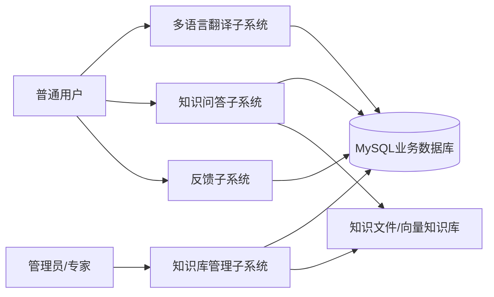
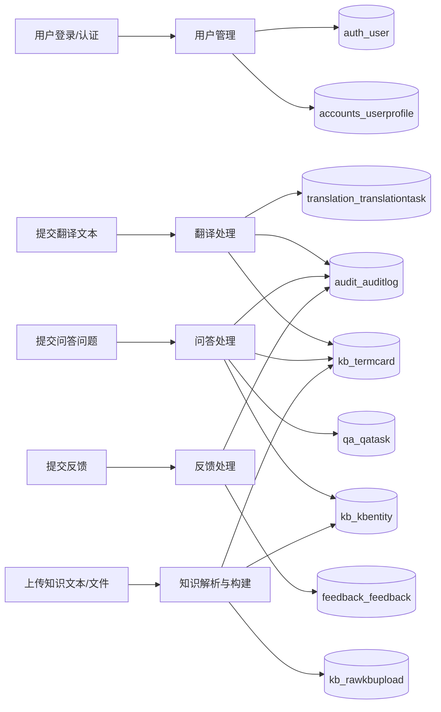
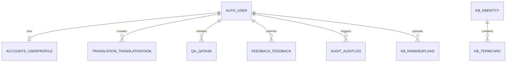

# 基于Transformer的医疗领域多语言互译及知识问答系统数据库设计说明书

## 1 引言

### 1.1 编写目的

编写本数据库设计说明书的目的是对系统数据库的逻辑结构、物理结构、命名规范、实体关系和关键数据项进行统一说明，为数据库的建设、开发、测试、运行维护和后续扩展提供依据。通过本说明书，开发人员可以准确理解各业务表及其关系，测试人员可以据此设计数据验证方案，维护人员可以据此开展故障定位、性能分析和结构变更管理。

### 1.2 背景

1. 软件系统名称：基于Transformer的医疗领域多语言互译及知识问答系统的设计与实现。
2. 软件系统应用范围：面向医疗场景中的多语言文本互译、医学术语辅助展示、知识库构建和知识问答服务。
3. 软件系统用户类型：普通用户、专家用户、系统管理员。
4. 软件系统核心功能：
   - 用户注册、登录、资料维护与角色管理；
   - 医疗文本多语言翻译与翻译任务留痕；
   - 基于知识库检索增强的问答任务处理；
   - 医疗知识上传、解析、实体构建、术语卡片维护与训练数据生成；
   - 用户反馈采集与接口审计追踪。

### 1.3 术语

1. Transformer：一种基于自注意力机制的深度学习模型架构，是本系统多语言翻译与大模型问答能力的核心基础。
2. 多语言互译：在中文、英文、日文、法文、德文等语言之间进行医疗文本的自动翻译。
3. RAG：Retrieval-Augmented Generation，检索增强生成。系统先从知识库中检索相关内容，再结合大模型生成问答结果。
4. 知识实体：系统知识库中的标准医学概念对象，包含实体标识、类别、来源和多语言字段。
5. 术语卡片：面向实体维护的术语明细数据，记录术语语言、术语文本、术语类型和解释内容。
6. 审计日志：对关键接口请求进行记录的日志数据，包含访问动作、路径、请求标识、状态码和耗时等信息。

### 1.4 参考资料

1. 《基于Transformer的医疗领域多语言互译及知识问答系统的设计与实现》项目需求与实现材料。
2. Django 4.2.25 官方文档与 Django REST framework 3.16.1 官方文档。
3. MySQL 8.0 参考手册。
4. 项目源码中的模型、接口和配置文件。
5. 数据库结构导出报告：
   - `scripts/output/medical_ai_system_schema_report.md`
   - `scripts/output/medical_ai_system_schema_report.json`
6. 项目数据库结构导出脚本：`scripts/export_db_schema.py`。

## 2 需求分析

### 2.1 数据流图

#### 2.1.1 顶层数据流图

图2-1 顶层数据流图

#### 2.1.2 第2层数据流图

图2-2 第2层数据流图

#### 2.1.3 第3层数据流图

图2-3-1 翻译任务处理

图2-3-2 知识问答处理

图2-3-3 知识库构建处理

### 2.2 数据字典

#### 表2-1 数据结构

| 序号 | 数据结构 | 数据描述 | 组成 |
| --- | --- | --- | --- |
| 1 | 用户基础信息 | 系统认证相关的账号信息 | 用户ID、用户名、密码、邮箱、启用状态、加入时间 |
| 2 | 用户扩展信息 | 用户业务侧补充信息 | 用户ID、手机号、性别、年龄、职业、科室、医院、简介、头像、角色 |
| 3 | 翻译任务数据 | 多语言翻译处理结果 | 翻译任务ID、用户ID、源语言、目标语言、领域、源文本、基础翻译、LoRA翻译、最终译文、术语结果、耗时、状态 |
| 4 | 问答任务数据 | 知识问答过程记录 | 问答任务ID、用户ID、问题、语言、答案、置信度、来源片段、耗时、状态 |
| 5 | 反馈数据 | 用户对翻译或问答结果的反馈信息 | 反馈ID、用户ID、反馈场景、任务类型、任务ID、评分、意见、扩展信息、创建时间 |
| 6 | 审计日志数据 | 接口访问和系统行为留痕 | 日志ID、用户ID、动作、请求方法、路径、状态码、请求ID、IP、User-Agent、耗时、扩展信息、创建时间 |
| 7 | 原始知识上传数据 | 知识库构建前的原始输入 | 上传ID、上传用户、文件路径、文本内容、文件类型、处理状态、创建时间、更新时间 |
| 8 | 知识实体数据 | 医学知识标准实体 | 实体ID、实体键、规范键、类别、来源、多语言字段、创建时间、更新时间 |
| 9 | 术语卡片数据 | 实体下的多语言术语信息 | 卡片ID、实体ID、语言、术语、类型、解释文本 |

#### 表2-2 关键数据项

| 序号 | 数据项名 | 数据描述 | 数据类型（长度） | 取值范围 | 与其他数据项的逻辑关系 |
| --- | --- | --- | --- | --- | --- |
| 1 | id | 表内主键标识 | int / bigint | 自增正整数 | 各表主键 |
| 2 | username | 用户登录名 | varchar(150) | 系统内唯一 | `auth_user` 业务主键 |
| 3 | password | 用户登录密码摘要 | varchar(128) | Django 密码摘要字符串 | 与用户账号一一对应 |
| 4 | email | 用户邮箱 | varchar(254) | 合法邮箱格式 | 与用户账号关联 |
| 5 | user_id | 用户外键 | int | 对应 `auth_user.id` | 出现在多个业务表中 |
| 6 | role | 用户业务角色 | varchar(16) | `user` / `expert` / `admin` | 出现在 `accounts_userprofile` |
| 7 | phone | 联系电话 | varchar(20) | 可为空字符串 | 与用户扩展信息关联 |
| 8 | src_lang | 翻译源语言 | varchar(16) | `zh/en/ja/fr/de` 等 | 与 `tgt_lang` 组成翻译语言对 |
| 9 | tgt_lang | 翻译目标语言 | varchar(16) | `zh/en/ja/fr/de` 等 | 与 `src_lang` 组成翻译语言对 |
| 10 | domain | 翻译领域 | varchar(32) | 默认 `general` | 与翻译任务关联 |
| 11 | input_text | 输入原文 | longtext | 非空文本 | 对应翻译任务输入 |
| 12 | base_translation | 基础模型译文 | longtext | 可为空字符串 | 由基础模型生成 |
| 13 | lora_translation | LoRA模型译文 | longtext | 可为空字符串 | 由 LoRA 模型生成 |
| 14 | output_text | 最终翻译结果 | longtext | 非空文本 | 翻译任务输出 |
| 15 | terms_json | 术语抽取结果 | json | JSON 数组/对象 | 与翻译任务关联 |
| 16 | question | 问答问题 | longtext | 非空文本 | 问答任务输入 |
| 17 | answer | 问答答案 | longtext | 可为空字符串 | 问答任务输出 |
| 18 | confidence | 问答置信度 | double | 0.0 至 1.0 | 与问答来源相关 |
| 19 | sources_json | 问答来源片段 | json | JSON 数组 | 保存检索结果摘要 |
| 20 | scene | 反馈场景 | varchar(32) | `translation` / `qa` | 表示反馈归属模块 |
| 21 | task_type | 反馈任务类型 | varchar(64) | 业务自定义 | 与 `task_id` 共同描述反馈对象 |
| 22 | task_id | 反馈关联任务ID | varchar(64) | 业务自定义 | 逻辑关联翻译或问答任务 |
| 23 | rating | 用户评分 | smallint | 当前实现为整数评分 | 与反馈记录关联 |
| 24 | action | 审计动作 | varchar(128) | 如 `translation.translate`、`qa.ask` | 审计日志关键检索字段 |
| 25 | request_id | 请求唯一标识 | varchar(64) | 请求链路唯一值 | 用于追踪同一请求 |
| 26 | file | 上传文件路径 | varchar(100) | 文件系统相对路径 | 出现在原始知识上传表 |
| 27 | file_type | 上传文件类型 | varchar(20) | `txt` / `docx` / `other` | 与知识上传数据关联 |
| 28 | status | 处理状态 | varchar(16/20) | 业务定义状态值 | 翻译、问答、知识上传均使用 |
| 29 | entity_key | 实体唯一标识 | varchar(200) | 系统内唯一 | `kb_kbentity` 业务主键 |
| 30 | canonical_key | 实体规范键 | varchar(200) | 规范化概念标识 | 与实体聚合相关 |
| 31 | category | 实体类别 | varchar(100) | 疾病、药物、症状等 | 与知识实体关联 |
| 32 | source | 实体来源 | varchar(100) | 来源文件或来源标识 | 与原始上传逻辑关联 |
| 33 | langs | 多语言结构化内容 | json | 按语言存放的 JSON 对象 | 存储实体各语言块 |
| 34 | entity_id | 术语卡片所属实体ID | bigint | 对应 `kb_kbentity.id` | 术语卡片外键 |
| 35 | lang | 术语语言 | varchar(8) | `zh/en/ja/fr/de` 等 | 与实体术语关联 |
| 36 | term | 术语文本 | varchar(512) | 非空字符串 | 术语卡片核心字段 |
| 37 | explain_text | 术语解释文本 | longtext | 可为空字符串 | 术语卡片说明信息 |
| 38 | created_at | 创建时间 | datetime(6) | 有效日期时间 | 多表通用审计字段 |
| 39 | updated_at | 更新时间 | datetime(6) | 有效日期时间 | 出现在可修改实体表中 |
| 40 | latency_ms | 处理耗时 | int | 非负整数 | 与翻译、问答、审计关联 |

## 3 E-R模型设计

### 3.1 实体及属性

#### 表3-1 实体及核心属性

| 序号 | 实体名称 | 主键 | 核心属性 |
| --- | --- | --- | --- |
| 1 | 用户基础实体 | `auth_user.id` | username、password、email、is_active、is_staff、is_superuser、date_joined |
| 2 | 用户扩展实体 | `accounts_userprofile.id` | user_id、phone、gender、age、occupation、department、hospital、role、avatar_url |
| 3 | 翻译任务实体 | `translation_translationtask.id` | user_id、src_lang、tgt_lang、domain、input_text、output_text、terms_json、latency_ms、status |
| 4 | 问答任务实体 | `qa_qatask.id` | user_id、question、lang、answer、confidence、sources_json、latency_ms、status |
| 5 | 反馈实体 | `feedback_feedback.id` | user_id、scene、task_type、task_id、rating、comment、extra、created_at |
| 6 | 审计日志实体 | `audit_auditlog.id` | user_id、action、method、path、status_code、request_id、latency_ms、created_at |
| 7 | 原始知识上传实体 | `kb_rawkbupload.id` | uploaded_by_id、file、content、file_type、status、created_at、updated_at |
| 8 | 知识实体 | `kb_kbentity.id` | entity_key、canonical_key、category、source、langs、created_at、updated_at |
| 9 | 术语卡片实体 | `kb_termcard.id` | entity_id、lang、term、type、explain_text |

补充说明：

1. 用户完整信息由 `auth_user` 与 `accounts_userprofile` 两张表共同组成，其中前者负责认证，后者负责业务扩展属性。
2. 历史记录模块当前没有独立业务表，翻译历史与问答历史分别沉淀在 `translation_translationtask` 与 `qa_qatask` 中，页面级短期会话上下文通过 `django_session` 保存。
3. `feedback_feedback.task_type` 与 `feedback_feedback.task_id` 对翻译任务或问答任务形成业务关联，但当前数据库层未设置物理外键。
4. `kb_rawkbupload` 与 `kb_kbentity` 之间通过来源字段 `source` 形成业务关联，当前数据库层未设置物理外键。

### 3.2 E-R图

图3-1 全局E-R图

说明：

1. `AUTH_USER` 与 `ACCOUNTS_USERPROFILE` 为一对一关系。
2. `AUTH_USER` 与翻译任务、问答任务、反馈、审计日志、知识上传之间均为一对多关系。
3. `KB_KBENTITY` 与 `KB_TERMCARD` 之间为一对多关系。
4. `KB_RAWKBUPLOAD` 与 `KB_KBENTITY` 之间存在逻辑来源关系，但当前未建立数据库物理外键。

## 4 数据库实现

### 4.1 数据库命名约定和环境

#### 4.1.1 命名约定

1. 表命名规则：当前系统采用 Django 默认命名方式，使用 `应用名_模型名` 的小写形式，例如 `translation_translationtask`、`qa_qatask`、`kb_kbentity`。
2. 主键命名规则：各业务表统一使用 `id` 作为主键字段，其中 Django 内置用户表 `auth_user.id` 为 `int`，其他业务表主键主要为 `bigint`。
3. 外键命名规则：外键字段采用 `字段名_id` 或 `对象名_id` 形式，例如 `user_id`、`entity_id`、`uploaded_by_id`。
4. 索引命名规则：索引主要由 Django/MySQL 自动生成，普通索引和组合索引采用 `app_abbr_field_hash_idx` 或外键约束名形式，例如 `feedback_fe_scene_61ca03_idx`、`audit_audit_request_06fe30_idx`。
5. JSON字段使用规则：对结构不固定或多值结构化数据，使用 `json` 类型字段保存，例如 `terms_json`、`sources_json`、`langs`、`extra`。
6. 时间字段命名规则：统一使用 `created_at`、`updated_at` 记录创建与更新时间，审计表、任务表和知识库表均遵循该命名方式。

#### 4.1.2 数据库环境

#### 表4-1 数据库环境

| 项目 | 内容 |
| --- | --- |
| 数据库软件名称 | MySQL 8.0.40 |
| ORM/框架 | Django 4.2.25 + Django REST framework 3.16.1 |
| 数据库名称 | `medical_ai_system` |
| 存储引擎 | InnoDB |
| 字符集 | utf8mb4 |
| 排序规则 | utf8mb4_unicode_ci |
| 连接地址 | 127.0.0.1:3306 |
| Django 数据源别名 | `default` |
| 数据结构分析方式 | Django 模型 + MySQL `information_schema` + `scripts/export_db_schema.py` |
| 应用有效时区 | UTC |
| 连接初始化设置 | `SET time_zone = '+00:00'` |

### 4.2 数据表信息

#### 4.2.1 表列表

#### 表4-2 表清单

| 序号 | 中文名称 | 物理表名 | 备注 |
| --- | --- | --- | --- |
| 1 | 用户基础表 | `auth_user` | Django 内置认证表，保存账号核心信息 |
| 2 | 用户扩展信息表 | `accounts_userprofile` | 保存用户角色、医院、科室、头像等扩展资料 |
| 3 | 翻译任务表 | `translation_translationtask` | 保存多语言翻译请求、结果、术语信息和耗时 |
| 4 | 知识问答任务表 | `qa_qatask` | 保存问答问题、答案、来源片段、置信度和耗时 |
| 5 | 用户反馈表 | `feedback_feedback` | 保存用户对翻译或问答结果的评分与意见 |
| 6 | 审计日志表 | `audit_auditlog` | 保存接口动作、请求链路、状态码和耗时 |
| 7 | 原始知识上传表 | `kb_rawkbupload` | 保存原始文本或上传文件及其处理状态 |
| 8 | 知识实体表 | `kb_kbentity` | 保存医学实体、多语言结构块和来源信息 |
| 9 | 术语卡片表 | `kb_termcard` | 保存实体下的多语言术语和解释内容 |

#### 4.2.2 用户基础表

#### 表4-3 用户基础表

| 类别 | 序号 | 项目/中文名称 | 列名 | 数据类型 | 非空 | 内容/说明 |
| --- | --- | --- | --- | --- | --- | --- |
| 表信息 | - | 中文名称 | - | - | - | 用户基础表 |
| 表信息 | - | 物理表名 | - | - | - | `auth_user` |
| 表信息 | - | 主键 | - | - | - | `id` |
| 表信息 | - | 业务主键 | - | - | - | `username` |
| 表信息 | - | 索引 | - | - | - | `PRIMARY(id)`；`username(username)` 唯一索引 |
| 表信息 | - | 备注 | - | - | - | 系统认证核心表，承担登录、权限判断和账号启停控制 |
| 字段 | 1 | 用户ID | `id` | int | Y | 主键，自增 |
| 字段 | 2 | 密码摘要 | `password` | varchar(128) | Y | Django 密码摘要 |
| 字段 | 3 | 最近登录时间 | `last_login` | datetime(6) | N | 最近一次登录时间 |
| 字段 | 4 | 超级用户标志 | `is_superuser` | tinyint(1) | Y | 1表示超级管理员 |
| 字段 | 5 | 用户名 | `username` | varchar(150) | Y | 唯一约束 |
| 字段 | 6 | 名 | `first_name` | varchar(150) | Y | 可为空字符串 |
| 字段 | 7 | 姓 | `last_name` | varchar(150) | Y | 可为空字符串 |
| 字段 | 8 | 邮箱 | `email` | varchar(254) | Y | 邮箱地址 |
| 字段 | 9 | 员工标志 | `is_staff` | tinyint(1) | Y | 1表示后台管理用户 |
| 字段 | 10 | 启用标志 | `is_active` | tinyint(1) | Y | 1表示账号启用 |
| 字段 | 11 | 注册时间 | `date_joined` | datetime(6) | Y | 用户创建时间 |

#### 4.2.3 用户扩展信息表

#### 表4-4 用户扩展信息表

| 项目 | 内容 |
| --- | --- |
| 中文名称 | 用户扩展信息表 |
| 物理表名 | `accounts_userprofile` |
| 主键 | `id` |
| 业务主键 | `user_id` |
| 索引 | `PRIMARY(id)`；`user_id(user_id)` 唯一索引 |
| 外键 | `user_id -> auth_user.id` |
| 备注 | 与用户基础表一对一，保存业务侧扩展信息 |

字段列表：

| 序号 | 中文名称 | 列名 | 数据类型 | 非空 | 外键表/说明 |
| --- | --- | --- | --- | --- | --- |
| 1 | 记录ID | `id` | bigint | Y | 主键，自增 |
| 2 | 手机号 | `phone` | varchar(20) | Y | 默认空字符串 |
| 3 | 性别 | `gender` | varchar(1) | Y | `M/F/O` 或空字符串 |
| 4 | 年龄 | `age` | int | N | 用户年龄 |
| 5 | 职业 | `occupation` | varchar(100) | Y | 默认空字符串 |
| 6 | 科室 | `department` | varchar(100) | Y | 默认空字符串 |
| 7 | 医院 | `hospital` | varchar(200) | Y | 默认空字符串 |
| 8 | 简介 | `bio` | longtext | Y | 用户自我描述 |
| 9 | 头像地址 | `avatar_url` | varchar(500) | Y | 头像URL |
| 10 | 创建时间 | `created_at` | datetime(6) | Y | 自动生成 |
| 11 | 更新时间 | `updated_at` | datetime(6) | Y | 自动更新 |
| 12 | 用户ID | `user_id` | int | Y | 外键，唯一，对应 `auth_user.id` |
| 13 | 角色 | `role` | varchar(16) | Y | `user/expert/admin` |

#### 4.2.4 翻译任务表

#### 表4-5 翻译任务表

| 项目 | 内容 |
| --- | --- |
| 中文名称 | 翻译任务表 |
| 物理表名 | `translation_translationtask` |
| 主键 | `id` |
| 业务主键 | 无 |
| 索引 | `PRIMARY(id)`；`translation_translationtask_user_id_1cf22a12_fk_auth_user_id(user_id)` |
| 外键 | `user_id -> auth_user.id` |
| 备注 | 保存翻译输入、基础模型结果、LoRA结果、最终译文、术语抽取结果及耗时 |

字段列表：

| 序号 | 中文名称 | 列名 | 数据类型 | 非空 | 外键表/说明 |
| --- | --- | --- | --- | --- | --- |
| 1 | 任务ID | `id` | bigint | Y | 主键，自增 |
| 2 | 源语言 | `src_lang` | varchar(16) | Y | 如 `en`、`zh` |
| 3 | 目标语言 | `tgt_lang` | varchar(16) | Y | 如 `zh`、`de` |
| 4 | 领域 | `domain` | varchar(32) | Y | 默认 `general` |
| 5 | 输入文本 | `input_text` | longtext | Y | 翻译原文 |
| 6 | 最终译文 | `output_text` | longtext | Y | 对外返回的译文 |
| 7 | 术语结果 | `terms_json` | json | Y | 源术语、目标术语结构 |
| 8 | 处理耗时 | `latency_ms` | int | Y | 毫秒 |
| 9 | 任务状态 | `status` | varchar(16) | Y | `SUCCESS` / `FAIL` |
| 10 | 创建时间 | `created_at` | datetime(6) | Y | 自动生成 |
| 11 | 用户ID | `user_id` | int | Y | 外键，对应 `auth_user.id` |
| 12 | 基础模型译文 | `base_translation` | longtext | Y | 基础模型结果 |
| 13 | LoRA模型译文 | `lora_translation` | longtext | Y | LoRA模型结果 |

#### 4.2.5 知识问答任务表

#### 表4-6 知识问答任务表

| 项目 | 内容 |
| --- | --- |
| 中文名称 | 知识问答任务表 |
| 物理表名 | `qa_qatask` |
| 主键 | `id` |
| 业务主键 | 无 |
| 索引 | `PRIMARY(id)`；`qa_qatask_user_id_d161d646_fk_auth_user_id(user_id)` |
| 外键 | `user_id -> auth_user.id` |
| 备注 | 保存问题、答案、检索来源、置信度、处理耗时和状态 |

字段列表：

| 序号 | 中文名称 | 列名 | 数据类型 | 非空 | 外键表/说明 |
| --- | --- | --- | --- | --- | --- |
| 1 | 任务ID | `id` | bigint | Y | 主键，自增 |
| 2 | 问题内容 | `question` | longtext | Y | 用户问题 |
| 3 | 问答语言 | `lang` | varchar(16) | Y | 返回语言 |
| 4 | 答案内容 | `answer` | longtext | Y | 生成答案 |
| 5 | 置信度 | `confidence` | double | Y | 0到1之间 |
| 6 | 来源片段 | `sources_json` | json | Y | 检索来源列表 |
| 7 | 处理耗时 | `latency_ms` | int | Y | 毫秒 |
| 8 | 任务状态 | `status` | varchar(16) | Y | `SUCCESS` / `FAIL` |
| 9 | 创建时间 | `created_at` | datetime(6) | Y | 自动生成 |
| 10 | 用户ID | `user_id` | int | N | 外键，可为空，对应 `auth_user.id` |

#### 4.2.6 用户反馈表

#### 表4-7 用户反馈表

| 项目 | 内容 |
| --- | --- |
| 中文名称 | 用户反馈表 |
| 物理表名 | `feedback_feedback` |
| 主键 | `id` |
| 业务主键 | 无 |
| 索引 | `PRIMARY(id)`；`feedback_fe_scene_61ca03_idx(scene, created_at)`；`feedback_fe_task_ty_12d04e_idx(task_type, task_id)`；`feedback_fe_user_id_be0124_idx(user_id, created_at)` |
| 外键 | `user_id -> auth_user.id` |
| 备注 | 用于保存翻译和问答场景下的用户反馈与评分 |

字段列表：

| 序号 | 中文名称 | 列名 | 数据类型 | 非空 | 外键表/说明 |
| --- | --- | --- | --- | --- | --- |
| 1 | 反馈ID | `id` | bigint | Y | 主键，自增 |
| 2 | 反馈场景 | `scene` | varchar(32) | Y | `translation` / `qa` |
| 3 | 任务类型 | `task_type` | varchar(64) | Y | 逻辑关联任务类型 |
| 4 | 任务标识 | `task_id` | varchar(64) | Y | 逻辑关联任务ID |
| 5 | 评分 | `rating` | smallint | Y | 当前实现为整数评分 |
| 6 | 反馈内容 | `comment` | longtext | Y | 默认空字符串 |
| 7 | 扩展信息 | `extra` | json | Y | 扩展字段 |
| 8 | 创建时间 | `created_at` | datetime(6) | Y | 自动生成 |
| 9 | 用户ID | `user_id` | int | Y | 外键，对应 `auth_user.id` |

#### 4.2.7 审计日志表

#### 表4-8 审计日志表

| 项目 | 内容 |
| --- | --- |
| 中文名称 | 审计日志表 |
| 物理表名 | `audit_auditlog` |
| 主键 | `id` |
| 业务主键 | `request_id`（查询主键） |
| 索引 | `PRIMARY(id)`；`audit_audit_action_766c6d_idx(action, created_at)`；`audit_audit_request_06fe30_idx(request_id)`；`audit_audit_user_id_a3c2bc_idx(user_id, created_at)` |
| 外键 | `user_id -> auth_user.id` |
| 备注 | 保存关键接口访问轨迹，用于问题排查与行为审计 |

字段列表：

| 序号 | 中文名称 | 列名 | 数据类型 | 非空 | 外键表/说明 |
| --- | --- | --- | --- | --- | --- |
| 1 | 日志ID | `id` | bigint | Y | 主键，自增 |
| 2 | 动作名 | `action` | varchar(128) | Y | 如 `translation.translate` |
| 3 | 请求方法 | `method` | varchar(16) | Y | GET/POST等 |
| 4 | 请求路径 | `path` | varchar(512) | Y | 接口路径 |
| 5 | 状态码 | `status_code` | int | N | HTTP状态码 |
| 6 | 访问IP | `ip` | varchar(64) | Y | 客户端IP |
| 7 | 客户端标识 | `user_agent` | varchar(512) | Y | 浏览器或终端信息 |
| 8 | 请求ID | `request_id` | varchar(64) | Y | 请求链路标识 |
| 9 | 耗时 | `latency_ms` | int | N | 接口耗时，毫秒 |
| 10 | 扩展信息 | `extra` | json | Y | 审计附加数据 |
| 11 | 创建时间 | `created_at` | datetime(6) | Y | 自动生成 |
| 12 | 用户ID | `user_id` | int | N | 外键，可为空，对应 `auth_user.id` |

#### 4.2.8 原始知识上传表

#### 表4-9 原始知识上传表

| 项目 | 内容 |
| --- | --- |
| 中文名称 | 原始知识上传表 |
| 物理表名 | `kb_rawkbupload` |
| 主键 | `id` |
| 业务主键 | 无 |
| 索引 | `PRIMARY(id)`；`kb_rawkbupload_uploaded_by_id_67d76fff_fk_auth_user_id(uploaded_by_id)` |
| 外键 | `uploaded_by_id -> auth_user.id` |
| 备注 | 保存知识文本或文件原文，是知识解析和知识库构建的输入来源 |

字段列表：

| 序号 | 中文名称 | 列名 | 数据类型 | 非空 | 外键表/说明 |
| --- | --- | --- | --- | --- | --- |
| 1 | 上传ID | `id` | bigint | Y | 主键，自增 |
| 2 | 文件路径 | `file` | varchar(100) | N | 上传文件相对路径 |
| 3 | 文本内容 | `content` | longtext | Y | 原始文本内容 |
| 4 | 文件类型 | `file_type` | varchar(20) | Y | `txt/docx/other` |
| 5 | 处理状态 | `status` | varchar(20) | Y | `NEW/PARSED/TRANSLATED/BUILD` |
| 6 | 创建时间 | `created_at` | datetime(6) | Y | 自动生成 |
| 7 | 更新时间 | `updated_at` | datetime(6) | Y | 自动更新 |
| 8 | 上传用户ID | `uploaded_by_id` | int | N | 外键，可为空，对应 `auth_user.id` |

#### 4.2.9 知识实体表

#### 表4-10 知识实体表

| 项目 | 内容 |
| --- | --- |
| 中文名称 | 知识实体表 |
| 物理表名 | `kb_kbentity` |
| 主键 | `id` |
| 业务主键 | `entity_key` |
| 索引 | `PRIMARY(id)`；`entity_key(entity_key)` 唯一索引 |
| 外键 | 无 |
| 备注 | 保存标准医学实体及其多语言结构数据，是知识检索与术语展示的核心表 |

字段列表：

| 序号 | 中文名称 | 列名 | 数据类型 | 非空 | 外键表/说明 |
| --- | --- | --- | --- | --- | --- |
| 1 | 实体ID | `id` | bigint | Y | 主键，自增 |
| 2 | 实体键 | `entity_key` | varchar(200) | Y | 唯一约束 |
| 3 | 规范键 | `canonical_key` | varchar(200) | Y | 概念规范键 |
| 4 | 类别 | `category` | varchar(100) | Y | 实体类别 |
| 5 | 来源 | `source` | varchar(100) | Y | 来源文件或来源标识 |
| 6 | 多语言块 | `langs` | json | Y | 按语言存储的结构化对象 |
| 7 | 创建时间 | `created_at` | datetime(6) | Y | 自动生成 |
| 8 | 更新时间 | `updated_at` | datetime(6) | Y | 自动更新 |

#### 4.2.10 术语卡片表

#### 表4-11 术语卡片表

| 项目 | 内容 |
| --- | --- |
| 中文名称 | 术语卡片表 |
| 物理表名 | `kb_termcard` |
| 主键 | `id` |
| 业务主键 | 无 |
| 索引 | `PRIMARY(id)`；`kb_termcard_entity_id_ea098519_fk_kb_kbentity_id(entity_id)` |
| 外键 | `entity_id -> kb_kbentity.id` |
| 备注 | 保存知识实体在不同语言下的术语与解释内容 |

字段列表：

| 序号 | 中文名称 | 列名 | 数据类型 | 非空 | 外键表/说明 |
| --- | --- | --- | --- | --- | --- |
| 1 | 卡片ID | `id` | bigint | Y | 主键，自增 |
| 2 | 语言 | `lang` | varchar(8) | Y | 如 `zh/en/ja/fr/de` |
| 3 | 术语文本 | `term` | varchar(512) | Y | 术语名称 |
| 4 | 术语类型 | `type` | varchar(64) | Y | 术语类别 |
| 5 | 解释文本 | `explain_text` | longtext | Y | 术语说明 |
| 6 | 实体ID | `entity_id` | bigint | Y | 外键，对应 `kb_kbentity.id` |

## 5 说明

1. 本说明书基于当前项目代码、Django 模型定义和实际 MySQL 库结构生成，已与当前数据库中的 9 张核心业务表对齐。
2. Django 系统基础表如 `auth_group`、`auth_permission`、`django_session`、`django_admin_log` 等未作为本系统业务表重点展开，但它们仍属于实际运行数据库的一部分。
3. 若后续新增知识审核、训练批次、历史记录归档、术语审核流等模块，建议在本说明书基础上继续补充新的实体关系和表结构章节。
