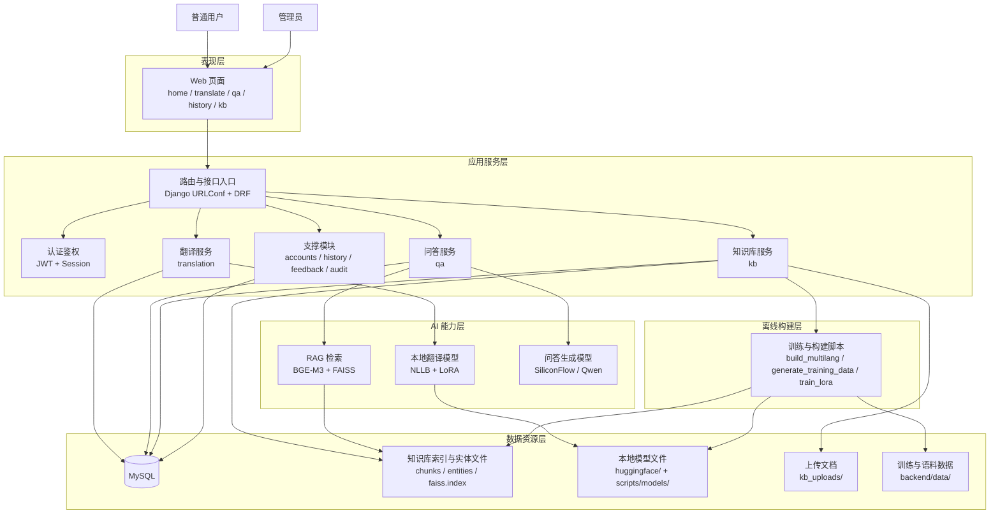
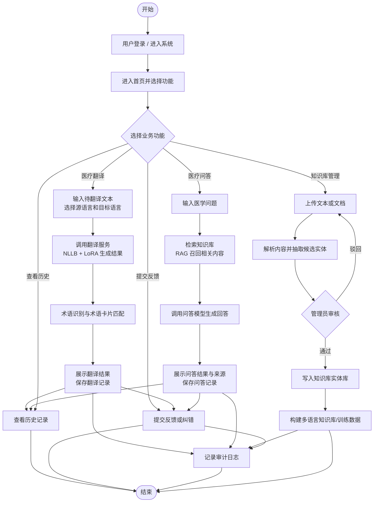
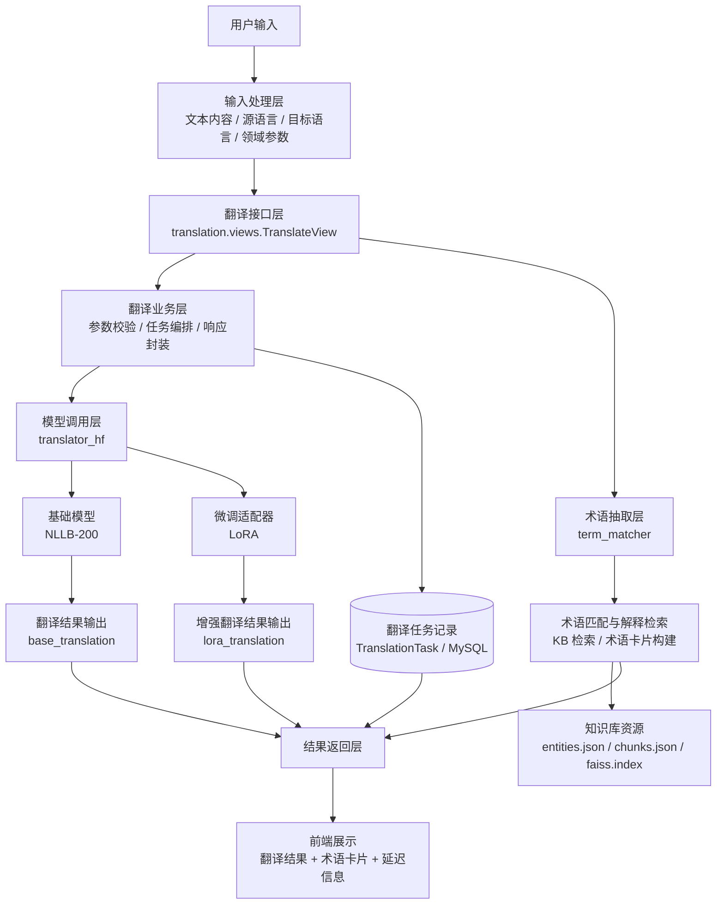
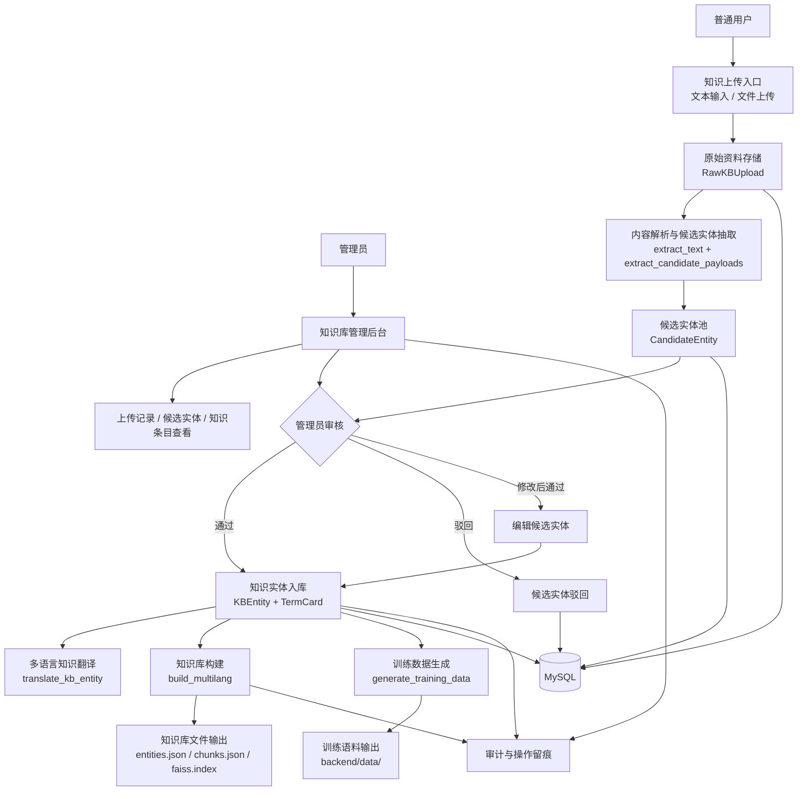
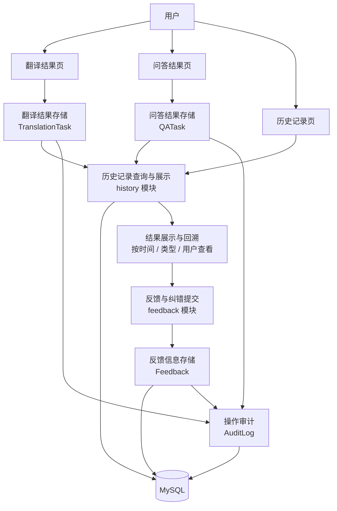

# 系统功能结构说明

结合当前仓库实现，系统整体是一个以 `Django` 为核心的医疗 AI Web 应用，前台提供翻译、问答、历史记录与知识库页面，后台承载接口、知识库管理、模型调用和数据持久化。

## 技术栈概览

| 层级 | 当前技术栈 | 说明 |
| --- | --- | --- |
| 前端展示层 | `Django Templates`、`HTML`、`CSS`、`JavaScript` | 提供首页、翻译页、问答页、历史页、登录注册页、知识库管理页 |
| Web 服务层 | `Django 4.2`、`Django REST Framework`、`JWT` | 提供页面路由、API 接口、登录鉴权、业务编排 |
| 业务应用层 | `accounts`、`translation`、`qa`、`history`、`feedback`、`audit`、`kb` | 负责用户、翻译、问答、知识库、反馈、审计等模块 |
| AI 能力层 | `Transformers`、`PEFT/LoRA`、`sentence-transformers`、`FAISS`、`OpenAI SDK` | 负责本地翻译、向量检索、RAG 问答、外部模型调用 |
| 数据存储层 | `MySQL`、知识库文件、模型目录、上传文件目录 | 存储业务数据、知识库索引、训练产物、上传文档 |
| 训练与数据处理层 | `scripts/` 下训练与构建脚本 | 用于 LoRA 微调、知识库多语言构建、训练数据生成与评估 |


## 系统总体架构图



## 系统业务流程图



## 翻译模块结构图



## 问答模块流程图

```mermaid
flowchart TB
    START([开始])
    INPUT[用户输入医学问题\n选择回答语言]
    API[问答接口\nqa.views.QAView]
    CHECK{问题是否有效}

    RETRIEVE[检索知识库\nget_kb().search top_k]
    CONTEXT[整理召回结果\n构建上下文与来源列表]
    JUDGE{是否检索到有效上下文}

    LLM[调用问答生成模型\nSiliconFlow / Qwen]
    FALLBACK[返回默认兜底回答]

    ANSWER[生成最终回答]
    SAVE[保存问答记录\nQATask / Session]
    AUDIT[写入审计日志]
    OUTPUT[返回答案、置信度、来源、耗时]
    END([结束])

    START --> INPUT --> API --> CHECK
    CHECK -->|否| FALLBACK
    CHECK -->|是| RETRIEVE --> CONTEXT --> JUDGE

    JUDGE -->|否| FALLBACK
    JUDGE -->|是| LLM --> ANSWER

    FALLBACK --> ANSWER
    ANSWER --> SAVE --> AUDIT --> OUTPUT --> END
```

## 知识库管理模块图



## 历史记录与结果管理模块图



## 四、说明

从当前系统实现情况看，翻译与问答是核心功能，术语识别与知识库是支撑功能，医疗文本解析与预约挂号属于增强功能。系统采用模块化设计，各功能之间既可以独立使用，也可以相互联动，形成“翻译 - 术语解释 - 知识问答 - 历史追踪 - 后台维护”的完整闭环。

